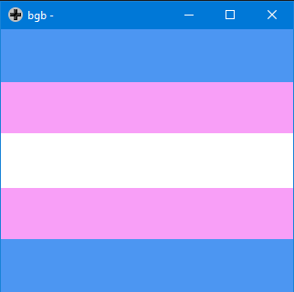

# trans-flag-gb
Small demo made with C using GBDK (Because I was too confused to use RGBDS/ASM).

## Building
The provided makefile relies on [gbdk-2020](https://github.com/Zal0/gbdk-2020).

Just run `make` and it should compile.

# Usage
Run `trans.gbc` on a Game Boy Color compatible emulator on on real hardware.

# Why?
I realized that the GBC's palette allows for colors similar to the trans pride colors. and that was enough to spend a few hours on this.

# Inspiration
https://github.com/lunasorcery/cga-trans-flag